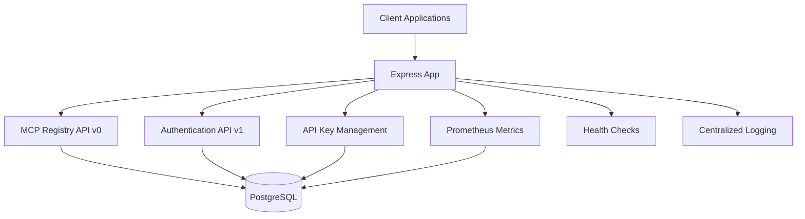

# Service Layer Architecture and Implementation

**Last Updated**: September 14, 2025  
**Framework**: Express.js 4.19.2  
**Runtime**: Node.js 18+  
**Status**: Production-ready with live deployment

## Executive Summary

The MCP Sub-Registry implements a clean service layer architecture using Express.js and TypeScript. The system provides a Model Context Protocol (MCP) v2025-07-09 compliant registry with dual authentication (JWT + API Keys), comprehensive security middleware, validation, metrics, and audit capabilities.

## Architecture Overview

## Core Service Components

### 1. Application Bootstrap (`src/app.ts`)

**Purpose**: Central Express application configuration and middleware setup

**Key Features**:
- Security middleware (Helmet with CSP in production)
- CORS configuration (environment-based origins)
- Compression middleware for response optimization
- Global rate limiting (1000 req/15min in production)
- JSON payload parsing with 1MB limit
- Error handling and 404 middleware

### 2. Server Lifecycle Management (`src/index.ts`)

**Purpose**: Server startup, shutdown, and process management

**Key Features**:
- Environment loading with `dotenv/config` for production
- Graceful startup with database connection validation
- Signal handling for SIGTERM and SIGINT
- Automatic process exit on database connection failure
- Port configuration from environment (default: 3010)

**Features**:
- Health check endpoint: `/health`
- Metrics endpoint: `/metrics`
- Graceful shutdown with database disconnect

### 3. MCP Registry API Service (`src/routes/v0.ts`)

**Purpose**: Core Model Context Protocol registry implementation

**Endpoints**:
- `GET /v0/servers` - Public server discovery with pagination
- `GET /v0/servers/:id` - Public individual server retrieval
- `POST /v0/publish` - Authenticated server publishing
- `GET /v0/health` - MCP-compliant health check

**Security Implementation**:
- **Authentication**: 
  - Optional auth for read operations (`optionalAuth(['read'])`)
  - Required auth for publishing (`requireAuth(['publish'])`)
- **Rate Limiting**: Publishing limited to 10 req/min in production
- **Validation**: Joi schema validation via `validateBody(serverPublishSchema)`

**Key Features**:
- **Pagination**: Query validation with `paginationQuerySchema`
- **Status Filtering**: Validated enum values
- **Audit Trail**: Complete logging with user/API key attribution
- **Duplicate Prevention**: 409 on existing server names

### 4. Authentication Service (`src/routes/auth.ts`)

**Purpose**: User management and JWT-based authentication

**Endpoints**:
- `POST /api/v1/auth/register` - Admin user registration (production: requires x-admin-key header)
- `POST /api/v1/auth/login` - User authentication
- `GET /api/v1/auth/me` - Token validation and current user info

**Production Security**:
- **Registration Control**: Disabled in production unless admin setup key provided
- **Password Security**: bcrypt with 12 rounds (configurable)
- **Token Management**: JWT with 8-hour expiration
- **Password Validation**: Requires uppercase, lowercase, number, and special character

**Implementation Details**:
- Only 'admin' role implemented
- Last login tracking on successful authentication
- Generic error responses to prevent user enumeration

### 5. API Key Management Service (`src/routes/api-keys.ts`)

**Purpose**: API key lifecycle management for programmatic access

**Endpoints**:
- `POST /api/v1/api-keys/create` - Create new API key (admin only)
- `GET /api/v1/api-keys` - List API keys with pagination
- `GET /api/v1/api-keys/:id` - Get specific API key details
- `PATCH /api/v1/api-keys/:id` - Update API key (name, description, active status)
- `DELETE /api/v1/api-keys/:id` - Revoke API key

**Security Features**:
- **Key Generation**: Cryptographically secure with `mcp_` prefix
- **Storage**: SHA-256 hashed keys in database
- **Scopes**: Granular permissions (read, write, publish, admin)
- **Expiration**: Optional time-based expiration
- **Rate Limiting**: 5 API keys per hour maximum

### 6. Metrics and Monitoring (`src/routes/metrics.ts`)

**Purpose**: Prometheus-compatible metrics for operational monitoring

**Metrics Provided**:
- `mcp_registry_servers_total` - Total server count
- `mcp_registry_servers_by_status` - Server distribution by status
- `mcp_registry_users_total` - User registration metrics
- `mcp_registry_users_active` - Active user count
- `mcp_registry_info` - Registry metadata
- `mcp_registry_up` - Uptime indicator

**Features**:
- Prometheus text format compliance
- Parallel database queries for performance
- Error state monitoring

## Middleware Architecture

### 1. Authentication Middleware (`src/middleware/auth.ts`)

**Purpose**: Flexible authentication supporting both JWT and API keys

**Key Features**:
- **Dual Authentication**: Supports Bearer tokens (JWT) and ApiKey headers
- **Scope-based Authorization**: Fine-grained permission control
- **Flexible Configuration**: Optional/required auth, method restrictions
- **Request Enhancement**: Adds user and api_key to request object

**Security Details**:
- API key validation with SHA-256 hashing
- JWT verification with configurable secret
- Automatic last_used timestamp updates
- User activity status validation

### 2. Validation Middleware (`src/middleware/validation.ts`)

**Purpose**: Request validation using Joi schemas

**Validation Schemas**:
- **Server Publishing**: Reverse DNS naming, semantic versioning, metadata validation
- **API Key Creation**: Name, description, scopes, expiration validation
- **User Registration**: Email, username, strong password requirements
- **Pagination**: Query parameter validation with defaults

**Key Features**:
- Schema-based validation with detailed error messages
- Request body sanitization (strips unknown fields)
- Custom error formatting with field-level details
- Pattern validation for complex formats (versions, DNS names)

### 3. Security Middleware (`src/middleware/security.ts`)

**Purpose**: Rate limiting for different endpoint categories

**Rate Limiters**:
1. **Global Rate Limit**: 1000 req/15min (production)
2. **Auth Rate Limit**: 5 req/15min for authentication endpoints
3. **Publish Rate Limit**: 10 req/min for server publishing
4. **API Key Rate Limit**: 5 keys/hour maximum

**Features**:
- Environment-aware limits (relaxed in development)
- Health check exemptions
- Successful request skipping for auth endpoints
- Standard rate limit headers

## Infrastructure Services

### Database Layer (`src/db.ts`)

**Purpose**: Database connection management and lifecycle

**Key Features**:
- Singleton Prisma client pattern
- Environment-based logging configuration
- Connection health validation
- Graceful disconnect handling

**Configuration**:
- Development: Error and warning logs
- Production: Error logs only
- Automatic process termination on connection failure

### Logging Service (`src/utils/logger.ts`)

**Purpose**: Centralized application logging with environment awareness

**Key Features**:
- Environment-specific log levels
- Structured logging with timestamps

**Log Levels**:
- **Debug**: Development environment only
- **Info**: General application events
- **Warn**: Non-critical issues
- **Error**: Critical system failures

## Security Implementation

### Authentication Security
- **Password Hashing**: bcrypt with 12 rounds (configurable via BCRYPT_ROUNDS)
- **Token Security**: JWT with 8-hour expiration (HS256 algorithm)
- **API Key Security**: SHA-256 hashed storage with secure random generation
- **Password Requirements**: Uppercase, lowercase, number, and special character
- **Error Masking**: Generic error responses prevent user enumeration

### API Security
- **Helmet Integration**: 
  - CSP enabled in production with strict directives
  - Cross-origin embedder policy in production
  - XSS and clickjacking protection
- **CORS Configuration**: 
  - Environment-based allowed origins
  - Credentials support enabled
- **Rate Limiting**: Multiple tiers for different endpoint types
- **Input Sanitization**: Joi schema validation with unknown field stripping
- **Audit Logging**: Complete trail for CREATE, UPDATE, DELETE operations

## Operational Features

- **Health Endpoints**: `/health` and `/metrics` endpoints
- **Prometheus Metrics**: Server count, user metrics, uptime indicators
- **Structured Logging**: Environment-aware logging with proper levels
- **Graceful Shutdown**: Clean resource cleanup on SIGTERM/SIGINT

## Technical Implementation Notes

### Environment Variables
- DATABASE_URL (required)
- JWT_SECRET (required) 
- NODE_ENV (production/development/test)
- PORT (default: 3010)
- ADMIN_SETUP_KEY (required for production registration)

